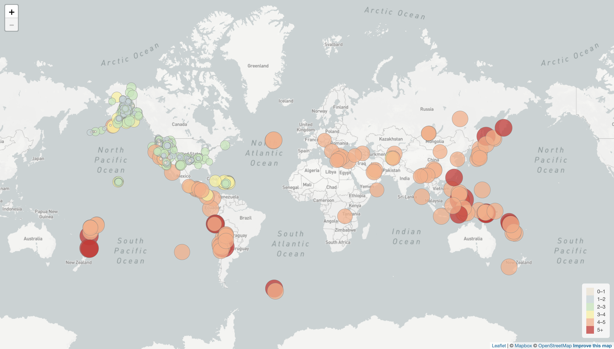
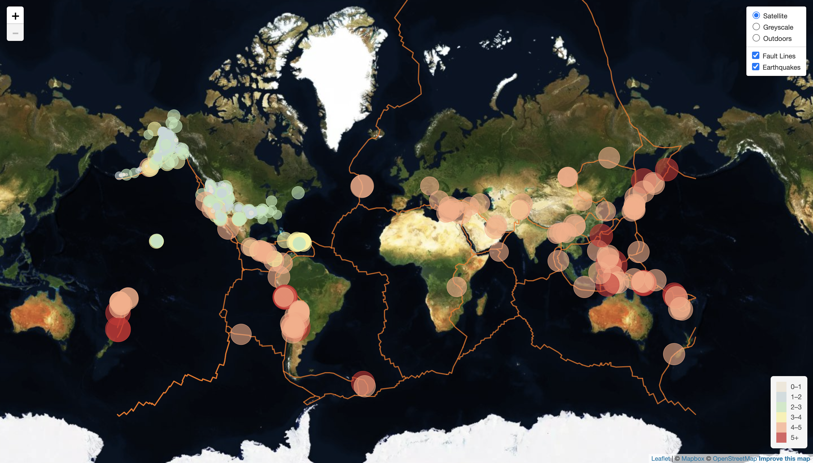

# Leaflet Visualization - Earthquake

## Background

The United States Geological Survey, USGS, is interested in building a new set of tools that will allow them visualize their earthquake data. They collect a massive amount of data from all over the world each day, but they lack a meaningful way of displaying it. Their hope is that being able to visualize their data will allow them to better educate the public and other government organizations (and hopefully secure more funding..) on issues facing our planet.

## Library

- Javascript (Leaflet)

- HTML

## Earthquake Visualization

**[View Script](Leaflet-Step-1/static/js/logic.js)**

The USGS provides earthquake data in a number of different formats, updated every 5 minutes. Retriving earthquake data in the past 7 days from USGS and using the Leaflet Javascript to create the visualization of the map based on the dataset.

- Markers reflect the magnitude of the earthquakes both size and color (higher magnitude > bigger marker and darker color).

- Popup of each earthquake contain information about place, time and magnitude.

- Legend on the bottom-right of the map that will provide context the map data.

  

## Tectonic Plates and Seismic Activity

**[View Script](Leaflet-Step-2/static/js/logic.js)**

Ploting a second data set on your map to illustrate the relationship between tectonic plates and seismic activity. Data on tectonic plates can be found at https://github.com/fraxen/tectonicplates.

- Three base maps; Satellite, Greyscale and Outdoors.

- Two data sets; earthquakes and tectonic plates data.

- Two different data sets will be separated from the base maps.

- These two different data sets will be turned on and off independently.

- Layer control on the top-right allows users to control the visualization of the map.

  

## Contributor

<a>© Atcharaporn B Puccini</a>

 
 

